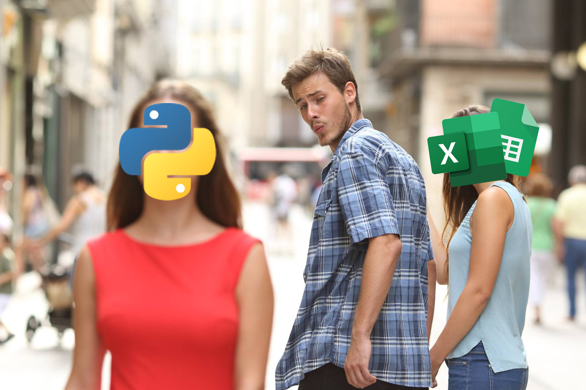

# Life After Spreadsheets:    Python for Productive People

**Three programming habits I wish I knew when I began teaching myself Python**

 </img>  

1. Don't Reinvent the Wheel, Borrow One
2. Throw Away Your Code (Often)
3. Keep it Simple

---

For most people, most of the time, spreadsheets are the right choice for the job. They are the most accessible, the easiest to use, and offer the best set of tools for organizing, manipulating, and presenting data.

But for some, there may come a time when their data needs exceed that of what could be accomplished in a spreadsheet efficiently.

Making the jump from spreadsheets to Python can be an intimidating one. I've been there, and even tried several bandaid-like solutions _to avoid_ learning Python[1]. I did not believe in myself. In hindsight, my fear was based on a misconception I had, that because I did not have a background in computer science or software engineering, I did not have the foundation necesary to be successful with Python.

If you handle or analyze data on a regular basis, whether you are Python-curious, Python-reluctant, or beginning to learn Python as we speak, I would like to send you my encouragement and reassure you that:
* You don't need a computer science degree to build production-grade systems
* You don't need to be a software engineer to think like one
* You can succeed with Python

 

## Don't Reinvent the Wheel, Borrow One </img>
When solving business problems, you very rarely will need to venture into uncharted territory. This is especially true of Python, which attracts users from many different professional and academic fields, and has an immense collection of extended functionalities on [The Python Package Index](https://pypi.org/).

That is not to say that your problem is not complex, or that your solution will not be unique to your specific set of circumstances. Rather, this just means that it is inevitable that some or all of the business logic required to solve your problem is an existing, well-defined computing process or behavior.

During the planning and design phase of your Python project, be mindful to differentiate the details from the objective, and identify common behaviors in your project where you could leverage existing solutions. By developing an awareness of when you can lean on existing technologies, you can significantly decrease the time it takes you to get up and running.

An added benefit to using existing solutions for common problems is that oftentimes they are more thoroughly tested and can provide a greater layer of security than an in-house solution. For instance, Flask and Django are widely adopted frameworks you can leverage to handle some of the heavy lifting required by authentication protocols like OAuth 2.0.

 Have you been down the authentication rabbit hole? Have you or a loved one been affected by refresh tokens? 

 

## Throw Away Your Code (Often)️ </img>

Be willing to delete some or all of your work and try again. It doesn’t matter if it is 100 lines. It doesn’t matter if you’ve been working on it for two hours or two weeks. You will occasionally be barking up the wrong tree. When this happens you have to be willing to let it go, regroup, ask for help, and throw away your code.

In a more literal sense, if you are beginning to utilize Python to solve problems in your day to day workflow, you should take full advantage of learning version control systems while working with code -- [git](https://git-scm.com/video/what-is-git) being the standard in most workplaces.

Keeping your project in a well maintained repository will make it much easier for you to collaborate with and receive feedback from engineers at your company. When you find that you’ve steered off course, version control will allow you to safely revert some or all of your project to a point that puts you back on course.

 

## Keep it Simple </img>
One of the best skills you can develop to increase your productivity is an awareness of when you have wandered into the deep end. For the ultra-curious it can be easy to get lost in the specifics, and look for a solution where there is not one.

It takes much more time to force the wrong tool(s) to behave the right way than it does to find the right tool. This is reinforced by some of the observations in [The Zen of Python](https://www.python.org/dev/peps/pep-0020/):

> Simple is better than complex.  
> Complex is better than complicated.

Invest in the final destination, not the road that takes you there. When you get tunnel vision on solving a problem a certain way, or with a particular method or library, you are likely to:

1. Decrease productivity
2. Increase complexity
3. Write code that is error-prone and hard to maintain

By forcing the wrong tool(s) to behave the right way for your specific problem, you will build a weak and limiting foundation for your application.

 

---

Keeping these three things in mind, you will have the foresight and situational awareness to identify and avoid common pitfalls on your Python journey.

I encourage you to put aside any doubts that may be holding you back and start learning Python on your own! I personally have found teaching myself Python to be an incredibly rewarding and satisfying experience.

There's not too many feelings better than writing a program that does parts of your job for you. I don't want to sound dramatic... but it's like giving yourself a million high fives, a raise, and kicking your feet up on a 24 karat gold desk.

And with a little bit of patience, persistence, and the three habits for how to teach yourself Python outlined in this post, I am confident that you will be automating yourself into redundancy in no time!

    
[1] If after reading this article, you still wish to avoid learning Python... I found _some_ success using basic command line utilities like `cat`, `awk`, `sed`, and `mv` to work with large volumes of text files more effectively. This proved fruitful, so I downloaded some additional packages from [Homebrew](https://brew.sh/) like `csvkit` (which is written in Python FYI) and `jq`, both of which I still use today.
