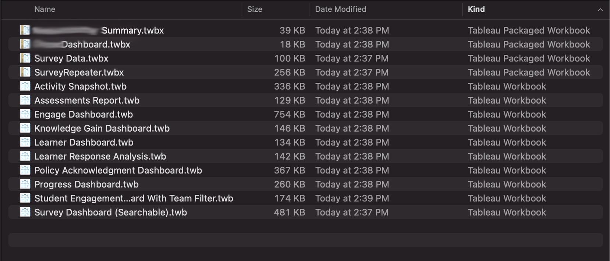

# Why Tableau does not "play nice" with Version Control Systems

I. Key Features and Benefits of Version Control Systems  
II. What about using git-lfs?  
III. What about the analysts?  

## Key Features and Benefits of Version Control Systems
Version Control Systems like git enable software teams to develop and collaborate with great accuracy, reliability, and ease (most of the time).

Unfortunately for Tableau developers, many of the core features of git do not play nice with Tableau files.

Tableau workbook files have the .twb file extension. Workbooks hold one or more worksheets, plus zero or more dashboards and stories. Here is an [example Tableau file](https://github.com/bcrant/tableau-style-validator/blob/main/tests/example_workbook.twb) for reference. These files are mostly human readable and formatted as XML.

Some of the features that provide the most value in VCSs under normal circumstances are Merge, Bisect, and Diff. Here we will provide an overview of these functionalities and discuss why these features, which are essential to software development teams, do not provide the same benefit for Tableau development teams.

### Merge
- Merging related changes to the same file
  - Editing .twb file contents directly is not supported by Tableau. (needs source)
  - Some users commit “XML Hacks”, but this is not appropriate for production environments and customer facing dashboards. (needs source)
  - The [Tableau Document API](https://www.tableau.com/developer/tools/document-api) enables some XML Hacks to be done safely.

- Merging unrelated changes to the same file
  - You would think this would be possible, say two people working on different dashboards that are part of the same workbook, but the principle is the same, editing .twb file contents directly is not supported by Tableau. (needs source)

### Diff
- Comparing changes between branches
  - The majority of the time, the diff of two workbooks will contain thousands of lines, making it impractical to decipher.
  - A diff of two .twb files may be useful in the event that there was a very, very small change. Some colors changing for instance.

- Deciding whether to rebase or merge
  - Not applicable for reasons listed under Merge.

### Bisect
- Identify the commit that introduced a bug
  - Similar reasons to Diff.
  - In application code, a commit-sized change could be presumed to be isolated to one file, and perhaps even more specifically, limited to  one function or class within a file.
  - Tableau Workbook files are monolithic documents.
  - A change to one component in a dashboard, for instance, would create changes in many different top level sections of the Tableau Workbook's XML.
  - Comparing the difference between a function or class in two branches is a much more valuable and informative activity than doing so with two workbook files.

# What about using Git Large File Storage (git-lfs)?
Git Large File Storage certainly sounds like a solution for working with lengthy Tableau files, but alas, it is not.

If you are familiar with Dropbox, I would liken git-lfs to the Selective Sync feature. Say I have a terabyte of music on my personal computer that is also backed up in Dropbox. Say I then get a new work laptop. I want to have my PDFs and notes or whatever that are on my personal computer and Dropbox to also be on my work laptop, but I don’t want a terabyte of music on my work laptop. I use Selective Sync on my work laptop to exclude the music files from actually being stored on my work laptop, but can still access those files from my work laptop through the pointers that exist in my Dropbox file system.

git-lfs allows you to designate certain files or file types similar to .gitignore. When I have used this previously, those file types were .twb and .twbx. When a file is added to git-lfs, the contents of that file are uploaded to the remote repository and the file itself, as it exists in the repository, is replaced with a hash that can be used to fetch its contents.

### Git-lfs is not designed for files that change frequently
For our use case, changes are made to existing dashboards far more frequently than new ones are added. Since these files are changed often, collaborators would still need to download the files from the remote repository into their local repository so that they can open and edit the file in Tableau Desktop.

### Git-lfs Is Not Beginner Friendly
'nuff said.

Git-lfs is not beginner friendly and Tableau developers may not have extensive software engineering or version control system experience to draw from. A simple solution will help teammates ease into version control.

Some may even argue that [no one should use git-lfs](https://gregoryszorc.com/blog/2021/05/12/why-you-shouldn't-use-git-lfs/).

### Tableau Workbooks Are Not Actually “Large Files”
We do not want to be storing data in any form, whether it be a flat files (.csv), data extracts (.hyper), or packaged workbooks (.twbx).

The Tableau Workbooks (.twb) that we do want under version control, which do not contain any raw data and mostly resemble XML files, are not “Large Files”.

In my experience, Tableau Workbooks are rarely larger than 2MB and most frequently less than 1MB. For reference I downloaded a handful of my production Tableau Workbooks an The largest one is 481KB:

# What about self-service Tableau users?
It would be expected that customer facing dashboards created by the data visualization team would always use connections to data rather than including extracts in a packaged workbook, but the same cannot be said for content on the Tableau Internal Server.

Self-service analytics does not entail that everyone who uses Tableau to also learn and use Version Control Systems. However, it does entail having vigorously tested single sources of truth for them to base their work off of, making them a prime candidate for version control.

The data analysts and pipeline team work diligently to build data sources and universal dashboards for many different functions of the organization. These single sources of truth need to be beyond reproach in order for self-service analytics users to gain trust in these data sets and confidently make decisions based on their analysis.

It is a not a hard requirement that the data analysts have the same workflow as the data visualization team, but I am of the opinion that a solution that is not simple, yet robust enough to handle both of these nearly-identical cases, is not an acceptable solution.
